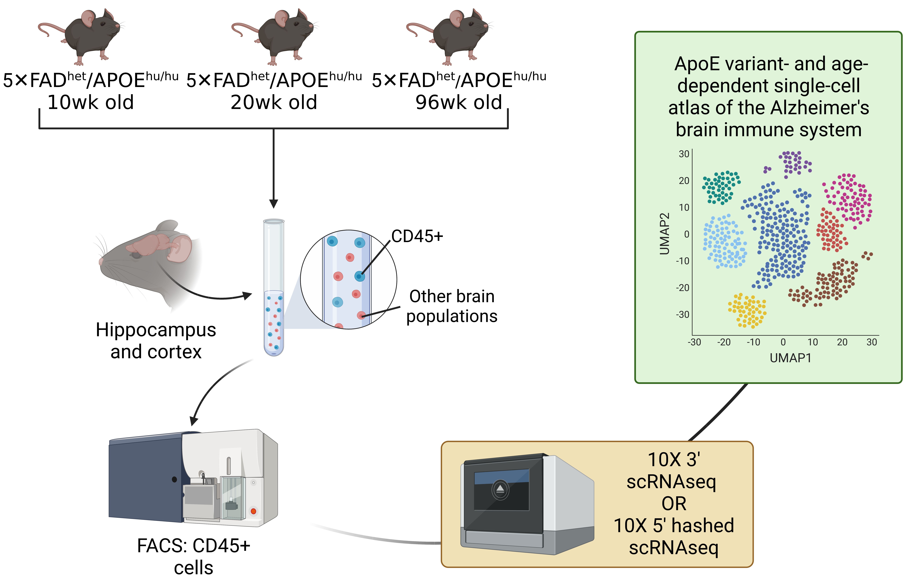

# apoe-ad-age-atlas
This repository contains the code needed to reproduce all results and plots in the paper "An Exhausted-Like Microglial Population that Accumulates in Aged and APOE4 Genotype Alzheimer’s Brains" from Millet, Ledo et al. Code snippets are separated into files mirroring the organization of figures in the manuscript.

**Fig_1A-G_and_Fig_S1.R**: code needed to generate Seurat structures for the 10wk/20wk/96wk atlas as well as microglial subclustering, plus code for all indicated figures (summary plots, DGE analysis, and preparation of code for CellRank). Raw sequencing data is uploaded to GEO, accession number GSE225503, along with the processed .rds files and their original CellRanger outputs.

> *Accompanying code: CellRank*: This folder contains the Python notebooks used to run CellRank on the data produced by the above R script. *Generate h5ad from fastq.ipynb* produces the splice-aware alignments needed to run scVelo. *scVelo Script - Unified, mglia only.ipynb* runs scVelo on this data to generate RNA velocity estimations. *CellRank - Unified, mglia only.ipynb* augments these estimations using a custom kernel.

**Fig_1H.R**: code needed to generate Figure 1H, showing the results of *in silico* decomposition of bulk sequencing of immune cells from aged animals using the atlas as a reference. Raw sequencing data is uploaded to GEO, accession number GSE239977, along with the processed .rds files and their original CellRanger outputs.

**Fig_2_and_Fig_S2A.R**: code needed to run SCENIC, CellPhoneDB, and Compass analysis.

> *Accompanying code: SCENIC.ipynb*: This provides the Python notebook used to run SCENIC on the data produced by the above R script.

**Fig_S2B-D.R**: code needed to analyze scUTRquant output. scUTRquant was run exactly per [suggested documentation](https://github.com/Mayrlab/scUTRquant) using the Snakemake pipeline, with `bx_whitelist`: "extdata/bxs/3M-february-2018.txt", `tech`: "10xv3", `strand`: "--fr-stranded", `min_umis`: 1000.

**Fig_3_and_Fig_S3.R**: code needed to generate Signac structures for the 60wk multiome sample as well as microglial subclustering, plus code for all indicated figures (summary plots, footprinting, LDA modeling, SCENIC+, CellPhoneDB, and Compass). Raw sequencing data is uploaded to GEO, accession number GSE225503, along with the processed .rds files and their original CellRanger outputs.

> *Accompanying code: SCENIC+.ipynb & MIRA Notebook.ipynb*: These provide the Python notebooks used to run SCENIC+ and MIRA on the data produced by the above R script.

**Fig_4_and_Fig_S4.R**: code needed to anchor integrate previously published human and mouse single-cell datasets with the data generated in this study and to produce the relevant plots in the manuscript. 

**Fig_5_and_Fig_S5.R**: code needed to analyze data produced from running the Xenium multiplexed *in situ* transcriptomics workflow on cortical tissue sections from six human AD donors. Raw data is uploaded to Zenodo, accession number 10.5281/zenodo.8206638, along with the processed anndata file and the full-slide scans taken after subsequent methoxy-X04 staining.

> *Accompanying code: Xenium.ipynb*: This provides the squidpy code used to analyze and annotate the raw data from the Xenium machine before data was exported to R for plotting.

**Fig_6.R**: code needed to analyze single-cell data generated by incubating immune cells from brains of aged AD mice with fluorescently labeled amyloid beta and sorting into high- and low-uptake populations. Raw sequencing data is uploaded to GEO, accession number GSE239974, along with the processed .rds files and their original CellRanger outputs.

**Fig_7_and_Fig_S6.R**: code needed to analyze single-cell data generated from Cd45+ cells isolated from brains of aged AD mice treated with either aducanumab or a human IgG control. Raw sequencing data is uploaded to GEO, accession number GSE239975, along with the processed .rds files and their original CellRanger outputs.
